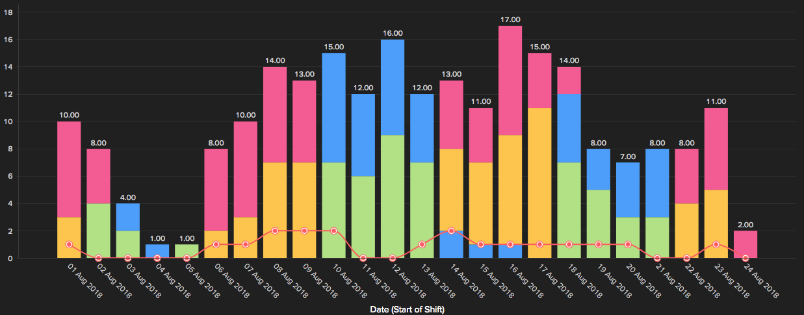
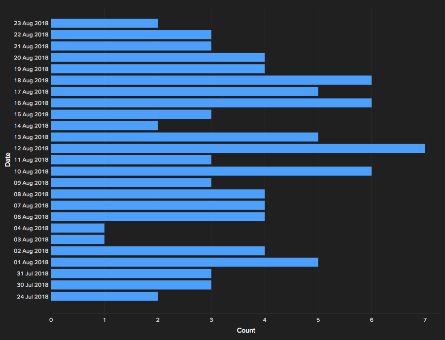

Close enough isn’t good enough.

In my experience, successfully navigating the closure of a project is equal parts confidence and empathy. You have to be strong enough to let go, but also respect the psyche of the customer. Additionally, you cannot be too eager to wash your hands and disengage preemptively. Winners want the ball, don’t settle for a field goal.

Unfortunately, I see projects left on the one-yard line all too often. Closing out an implementation or engagement is trickier than it seems. You would think that both parties would be happy to move forward — the professional excited to start a new project and the customer ready to take their shiny new solution for a ride — but it doesn’t work that way. Apprehension creeps in… are they going to break what I built? What happens if we need help? Did we forget anything? I really wish we had done X…

Below are three strategies that I use to gracefully end a project, stay engaged with the customer, and keep the door open for future growth.

## Provide Adoption Analytics and KPIs
Adding user adoption analytics has made a noticeable difference in carrying momentum forward through the end of development and into deployment. One challenge when completing a project is that the client has been relying on you and may feel ill-equipped to champion the effort on their own.

I wanted to share a set of analytics from a recent project that I believe is making the difference between the solution swimming or sinking. The purpose of the dashboard was to give a meaningful high-level view of the user adoption. Keeping people honest and using “the numbers” so critical conversations don’t feel so targeted help encourage positive adoption. So without further adieu, to the charts and graphs!

### Daily Submissions That Model Expected Usage

Showing how often the solution is being used can be a powerful too, but you get what you pay for and a simple bar graph of uploads isn’t going to tell you much. The graph above shows that users operate both day (yellow & green) and night (red & blue) shifts on a four-on-four-off schedule. Additionally, each team has a supervisor that is meant to drive adoption (red line).

So at a glance you’re able to discern that usage dipped starting on the 19th; blue team records were not uploaded properly on the 14th, 15th, and 16th; and the expected submission of two supervisor records per day — one per team — is not being consistently met. The following insights equip my solution champions to push forward and have meaningful conversations with their end users.

### Recognizing Bad Behavior

We implemented QR codes to improve the accuracy and speed of collecting data; however, in the early stages of deployment these three fields were able to be manually entered as well — we didn’t want the app to be ignored due to a worn or forgotten code. In response, records without QR scan were tracked. This gave champions the ability to monitor bad behaviors over time and drill down to easily check who is not using the solution correctly.

As the graph shows, the number of records that skipped the automated scan is beginning to decrease — a sign of proper usage.

## Put Time into Your Documentation
Completing a project is not like delivering a neatly wrapped Christmas present, it’s feels more like a painting where you can always add that one last touch. Having solid documentation as a final deliverable empowers you to put a bow on the painting.

So what makes good documentation? Good documentation varies based on the needs of the customer. Sometimes the customer needs an exhaustive reference of every nut, bolt, and error indicator. Other times instructive documentation is more beneficial as the primary challenge is onboarding new users.

The reality is that documentation takes time to do correctly and for that reason it’s either minimized by the provider (laziness) or by the customer (cutting cost corners). So how can you optimize your time while delivering excellent documentation? Here’s my advice.

- **Don’t present the documentation as optional.** Whether you choose to bake-in the cost with the overall project or include it as a required item, communicate to the customer that providing documentation is in their best interest. The key is to get ahead of things and state it early on. Ask the customer, what happens after the project completes? Future-planning doesn’t diminish confidence, it demonstrates care beyond the development life-cycle as well as expertise. You’ve been here before and the customer in front of you is reaping the benefits of experience.
- **Build in boilerplate expansion opportunities.** How do you keep documentation re-work to a minimum? You keep an exhaustive list of features the project may contain. The side benefit being that you’re passively answering the customer asking: what else could I do? Clients will frequently ask me — does my project have this? — to which I answer no, but let me explain what that is. You’re planting the seed early, demonstrating future expansion, and not being overly invasive.
- **Co-create the documentation.** This is a big one, do not leave the documentation to the end of the project. When this happens it becomes a massive brain dump that’s biased by the tone of the day. Use the documentation as a iterative tool to illicit feedback during project development. By co-creating the documentation you can more easily disengage, minimizing post-delivery documentation questions.

## Don't Completely Disengage, Set a Timeline
Remember, the goal is to gracefully disengage, not abruptly (and awkwardly) close the door. You should not set the tone that discussing the project beyond the delivery date is frowned upon! What you should do is control the narrative through setting a timeline. Gradually let go through weekly, then twice-monthly, then monthly then quarterly check-in calls. You want to both support the customer but give them room to learn. Even better, check-in calls can organically become opportunities to iterate and bring in more business!

I separate the period after delivery into two phases: support and maintenance. The support phase comes first and is more frequent because nothing stops user adoption like a broken solution. Still, set a timeline and adjust if necessary. The second phase of maintenance is where you focus on gathering feedback. If it’s a small adjustment then just make it at your discretion. The trust equity and appreciation that’s gained will outweigh missing a billable hour. If the feedback is more substantial it’s an opportunity to start framing the expansion of the project.

Ultimately, the key to successfully ending a project engagement is to treat it as a chapter in a book, not the end. Be clear about your investment in the customer’s success, use documentation as a solid way of guiding and concluding development, and set boundaries by establishing a timeline for initial support and extended maintenance.

**You may be delivering a project, but you’re building a relationship.**